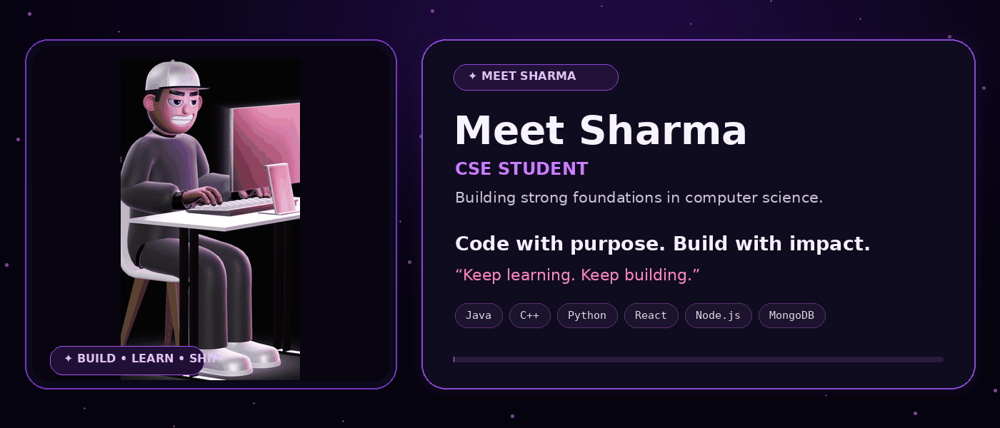
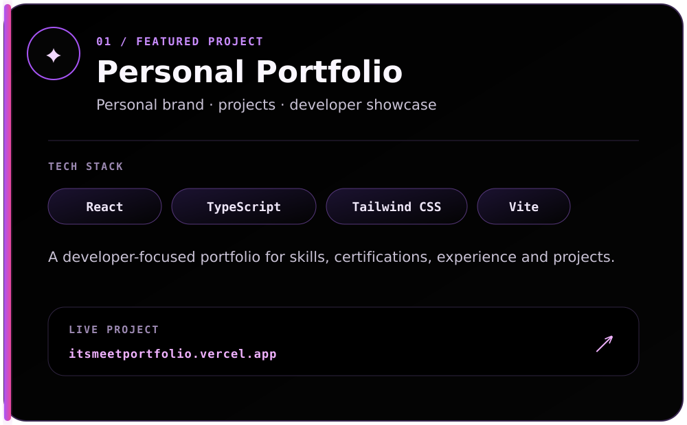
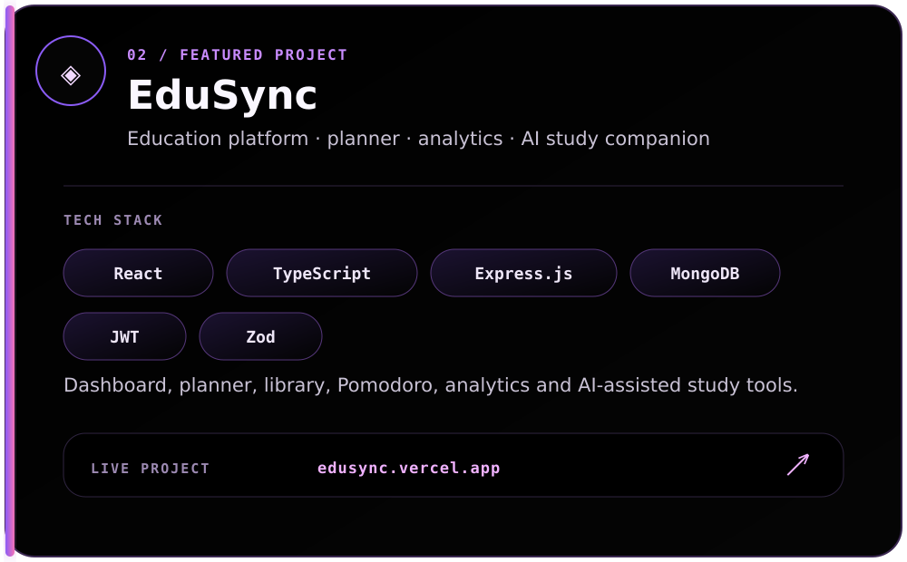
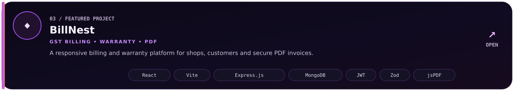
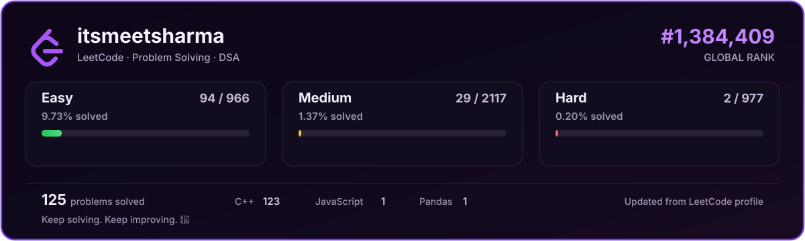
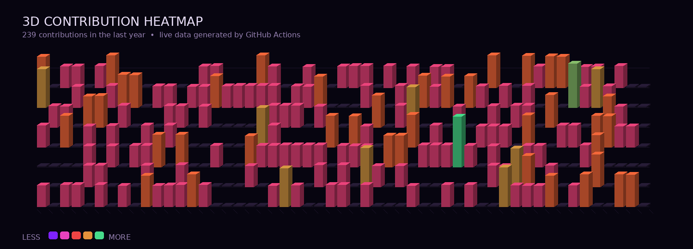

 

&nbsp;&nbsp;
&nbsp;&nbsp;
&nbsp;&nbsp;

 

## ✦ Featured Projects

  

  

  

 

## ⚡ Technology Knowledge

### Languages

|  Java |  C++ |  Python |  JavaScript |  TypeScript |
|---|---|---|---|---|

### Frontend

|  HTML |  CSS |  React.js |  Tailwind CSS |
|---|---|---|---|

### Backend

|  Node.js |  Express.js |
|---|---|

### Database

|  MongoDB |  MySQL |
|---|---|

### Tools & Platforms

|  Git |  GitHub |  VS Code |  Postman |  Vercel |  Netlify |  Canva |
|---|---|---|---|---|---|---|

 

## ◈ GitHub Analytics

<table width="100%" cellspacing="0" cellpadding="0">
<tr>
<td width="50%" align="center" valign="middle">

</td>
<td width="50%" align="center" valign="middle">

</td>
</tr>
</table>

 

## ◇ LeetCode

  

 

## 🟣 Contribution Heatmap

  

 

&nbsp;&nbsp;

  

✦ Build · Learn · Solve · Ship ✦

