<div align="center">



<br/>

<a href="https://www.linkedin.com/in/meetsharma777/"></a>&nbsp;&nbsp;
<a href="https://www.instagram.com/meetsharma777/"></a>&nbsp;&nbsp;
<a href="mailto:itsmeetsharma@gmail.com"></a>&nbsp;&nbsp;
<a href="https://leetcode.com/u/itsmeetsharma/"></a>

<br/><br/>

<a href="https://git.io/typing-svg"></a>

</div>


## 👋 About Me

<table width="100%">
<tr>
<td width="58%" valign="top">

I'm **Meet Sharma**, a Computer Science engineering student focused on building strong fundamentals and turning ideas into useful software.

- 💻 Building full-stack applications with **Java, JavaScript, TypeScript & MERN**
- 🧠 Strengthening **DSA, problem solving and core CS concepts**
- 🚀 Interested in clean architecture, practical products and continuous learning
- ⚡ My approach: **understand deeply → build simply → improve continuously**

</td>
<td width="42%" align="center" valign="middle">

```text
┌────────────────────────────┐
│       CURRENT FOCUS        │
├────────────────────────────┤
│  ◈ Data Structures         │
│  ◈ Algorithms              │
│  ◈ Full-Stack Development  │
│  ◈ Software Engineering    │
│  ◈ Building Projects       │
└────────────────────────────┘
```

</td>
</tr>
</table>


## 🚀 Featured Projects

<p align="center">
  <a href="https://github.com/itsmeetsharma777/Portfolio"></a>
</p>

<p align="center">
  <a href="https://github.com/itsmeetsharma777/EduSync"></a>
</p>

<p align="center">
  <a href="https://github.com/itsmeetsharma777/BillNest"></a>
</p>


## ⚡ Tech Stack

<p align="center">
  
  <br/>
  
  <br/>
  
  <br/>
  
</p>

<div align="center">

`Java` `C++` `Python` `JavaScript` `TypeScript` `React` `Tailwind CSS` `Node.js` `Express.js` `MongoDB` `MySQL`

</div>


## 📊 GitHub Analytics

<table width="100%">
<tr>
<td width="50%" align="center">

</td>
<td width="50%" align="center">

</td>
</tr>
</table>

<br/>

<p align="center">
  
</p>


## 🟣 Contribution Activity

<p align="center">
  
</p>

<p align="center">
  <sub>REAL CONTRIBUTION HEATMAP • 3D ISOMETRIC VIEW • LIVE DATA</sub>
</p>


## 🧩 LeetCode

<p align="center">
  <a href="https://leetcode.com/u/itsmeetsharma/">
    
  </a>
</p>

<div align="center">

<a href="https://leetcode.com/u/itsmeetsharma/">🧠 View my LeetCode profile →</a>

</div>


## 🌐 Connect

<p align="center">
  <a href="https://www.linkedin.com/in/meetsharma777/"></a>
  <a href="mailto:itsmeetsharma@gmail.com"></a>
  <a href="https://leetcode.com/u/itsmeetsharma/"></a>
</p>

<br/>

<div align="center">


&nbsp;


<br/><br/>

<sub>✦ Build · Learn · Solve · Ship ✦</sub>

</div>

<br/>


